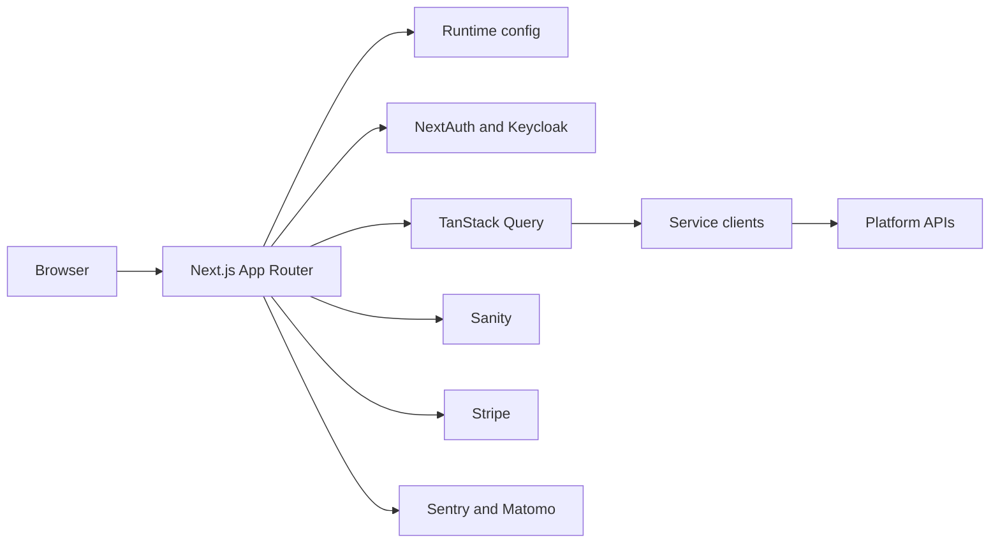
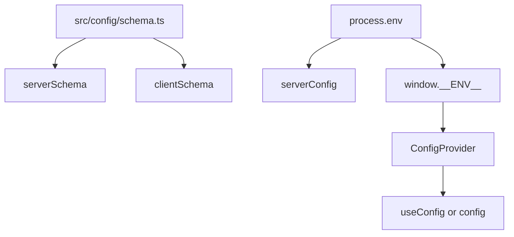

# Open Brain Institute Core Web App

Core web application for the Open Brain Institute. Built with Next.js, it provides access to neuroscience data, virtual labs, projects, simulation workflows, notebooks, reports, AI-assisted tools, and platform management features.

- Repository: [openbraininstitute/core-web-app](https://github.com/openbraininstitute/core-web-app/)
- License: [Apache 2.0](./LICENSE.txt)
- Runtime target: Next.js standalone server
- Package manager: pnpm 11

## Contents

- [Capabilities](#capabilities)
- [Technology stack](#technology-stack)
- [Project structure](#project-structure)
- [Local development](#local-development)
- [Configuration](#configuration)
- [Development workflow](#development-workflow)
- [Testing and quality gates](#testing-and-quality-gates)
- [Docker](#docker)
- [Deployment](#deployment)
- [Operational notes](#operational-notes)
- [Troubleshooting](#troubleshooting)
- [Acknowledgment](#acknowledgment)

## Capabilities

- Browse public and project-scoped neuroscience entities.
- Explore brain regions, circuits, cells, e-models, me-models, morphologies, recordings, and simulations.
- Create and manage virtual labs and projects.
- Build, extract, process, and simulate models through guided workflows.
- Launch and manage notebooks.
- View reports, showcases, and generated outputs.
- Use an AI assistant with optional tool integrations.
- Manage credits, payments, subscriptions, team access, and invitations.
- Collect feedback and newsletter subscriptions through platform APIs.

## Technology stack

| Area | Tooling |
| --- | --- |
| Framework | Next.js 16 App Router, React 19, TypeScript 5.9 |
| UI | Ant Design 5, Radix UI primitives, CSS Modules, Tailwind CSS 4 tooling |
| Data fetching | TanStack Query 5, custom api client wrapper |
| State and URL state | Jotai, `nuqs` |
| Auth | NextAuth 4 with Keycloak OAuth/OIDC and auth-manager refresh-token sync |
| Runtime config | Zod-validated server/client configuration with browser env injection |
| Content | Sanity |
| Payments | Stripe |
| Observability | Sentry, Matomo |
| Visualization | Three.js, Open Brain Institute MorphoViewer, Plotly, AG Grid, Monaco |
| AI | Vercel AI SDK packages and local AI assistant service layer |
| Quality | Biome, Vitest, Node test runner, Knip, custom barrel-import checks |
| Deployment | AWS Amplify previews, standalone Next.js Docker image, AWS Public ECR release workflow |

## Project structure

```text
src/
  app/                    Next.js App Router routes, layouts, route handlers, and errors
  api/                    Typed clients and helpers for platform backend services
  auth/                   NextAuth and Keycloak integration
  components/             Shared legacy and cross-cutting React components
  config/                 Runtime configuration schema, server/client accessors, and provider
  constants/              Platform constants and static markdown content
  entity-configuration/   Entity definitions and domain configuration
  features/               Feature-oriented modules with hooks, components, workers, and use cases
  hooks/                  Shared React hooks
  query-provider/         TanStack Query client, server hydration, and examples
  services/               Domain service wrappers for AI, notebooks, Sanity, simulations, virtual labs
  state/                  Jotai atoms and state providers
  styles/                 Global CSS and shared styles
  theme/                  Ant Design theme configuration
  ui/                     Current design-system primitives, molecules, layouts, and product segments
  utils/                  Shared utility functions
  wrappers/               Application wrappers
public/                   Static assets, downloads, generated thumbnails, and sample data
```

Important route conventions:

- `src/app/api` contains Next.js route handlers. The `/api` namespace is shared with
  platform services at the infrastructure layer; check existing service paths before
  adding a route.
- `src/api` contains client-side and server-side service clients. Prefer adding backend
  access here instead of inlining fetch logic in components.
- `src/ui/segments` contains product-level screens and workflow surfaces.
- `src/features` contains bounded feature modules. Keep feature-specific behavior close
  to the owning feature.

## Architecture



The app uses a build-once, deploy-everywhere configuration model. Server config is read
from `process.env`. Public client config is extracted from the same schema and injected
into `window.__ENV__` from the root layout.



## Local development

### Prerequisites

- Node.js 24 recommended to match CI and Docker. Node 22 also works in current local
  development environments.
- Corepack enabled.
- pnpm 11.
- Access to the required platform environment variables and service endpoints.
- Docker Desktop or compatible Docker runtime, only when building/running containers.

### Install

```bash
corepack enable
corepack prepare pnpm@11 --activate
pnpm install --frozen-lockfile
```

Use `pnpm install` without `--frozen-lockfile` only when intentionally updating
dependencies or the lockfile.

### Run the app

```bash
pnpm run dev
```

The dev script injects `APP_VERSION` from `make version` and starts Next.js at:

```text
http://localhost:3000
```

## Configuration

Configuration is defined in [`src/config/schema.ts`](./src/config/schema.ts) and
validated with Zod.

Tracked environment files provide shared defaults:

- `.env`
- `.env.development`
- `.env.production`

Ignored local override files are the right place for developer-specific secrets:

- `.env.local`
- `.env.development.local`
- `.env.test.local`
- `.env.production.local`

Docker Compose reads `.env`, `.env.development`, and optional `.env.development.local`.
Next.js also loads the standard Next env file cascade for local development.

Playwright E2E tests use the shared `.env` app defaults, then this test-specific
env cascade:

- `.env.test` for shared, non-secret test overrides.
- `.env.test.secrets` for local-only E2E secrets. This file is ignored by git.

CI must not rely on `.env.test.secrets`. Add the secret values in GitHub Actions
repository or environment secrets and expose them as environment variables when
running `pnpm run test:e2e`.

### Required core variables

| Variable | Purpose |
| --- | --- |
| `APP_VERSION` | Application version. Local dev sets this from `make version`; deployment sets it during build. |
| `DEPLOYMENT_ENV` | One of `local`, `preview`, `development`, `staging`, or `production`. |
| `ROOT_ROUTE` | Root route prefix used by the app. |
| `NEXTAUTH_SECRET` | NextAuth JWT/session secret. |
| `NEXTAUTH_URL` | NextAuth callback origin. Required by NextAuth runtime even though it is not part of the app Zod schema. |
| `KEYCLOAK_ISSUER` | Keycloak issuer URL. |
| `KEYCLOAK_CLIENT_ID` | Keycloak OAuth client ID. |
| `KEYCLOAK_CLIENT_SECRET` | Keycloak OAuth client secret. |
| `STRIPE_PUBLISHABLE_KEY` | Public Stripe publishable key. Must start with `pk_`. |
| `SANITY_PROJECT_ID` | Sanity project ID. |
| `SANITY_DATASET` | `staging` or `production`. |
| `ENTITY_CORE_PUBLIC_PROJECT_ID` | Default public entity-core project ID. |
| `ENTITY_CORE_PUBLIC_VIRTUAL_LAB_ID` | Default public entity-core virtual lab ID. |
| `APP_DEFAULT__BRAIN_REGION_HIERARCHY_ID` | Default brain-region hierarchy ID. |
| `MOUSE_ATLAS__ID` | Default mouse atlas ID. |
| `MOUSE_DEFAULT__SELECTED_BRAIN_REGION_ID` | Default selected mouse brain region. |
| `HUMAN_DEFAULT__SELECTED_BRAIN_REGION_ID` | Default selected human brain region. |
| `RAT_DEFAULT__SELECTED_BRAIN_REGION_ID` | Default selected rat brain region. |
| `EXCLUDED_HIERARCHY_IDS` | Comma-separated hierarchy IDs excluded from the app. |
| `LEGACY_DEFAULT_CIRCUIT_ID` | Default legacy circuit URL. |
| `NOTEBOOK_REPO_URL` | Notebook repository URL. |

### E2E test variables

| Variable | Source |
| --- | --- |
| `VIRTUAL_LAB_API_URL` | `.env.test`; GitHub Actions variable or secret in CI. |
| `KEYCLOAK_ISSUER` | `.env.test`; GitHub Actions variable or secret in CI. |
| `KEYCLOAK_CLIENT_ID` | `.env.test`; GitHub Actions variable or secret in CI. |
| `KEYCLOAK_CLIENT_SECRET` | `.env.test.secrets`; GitHub Actions secret in CI. |
| `E2E_TEST_USERNAME` | `.env.test.secrets`; GitHub Actions secret in CI. |
| `E2E_TEST_PASSWORD` | `.env.test.secrets`; GitHub Actions secret in CI. |

### Platform API variables

You can provide a single `API_ORIGIN`, or provide every service URL explicitly.
When `API_ORIGIN` is set, missing service URLs default to
`${API_ORIGIN}/api/<service-path>`.

| Variable | Default path when using `API_ORIGIN` |
| --- | --- |
| `AI_AGENT_URL` | `/api/agent-ts/api` |
| `AUTH_MANAGER_URL` | `/api/auth-manager/v1` |
| `CELL_API_URL` | `/api/circuit` |
| `ENTITY_CORE_URL` | `/api/entitycore` |
| `NOTEBOOK_API_URL` | `/api/notebook_service` |
| `OBI_ONE_URL` | `/api/obi-one` |
| `SMALL_SCALE_SIMULATOR_URL` | `/api/small-scale-simulator` |
| `THUMBNAIL_API_URL` | `/api/thumbnail-generation` |
| `VIRTUAL_LAB_API_URL` | `/api/virtual-lab-manager` |
| `LAUNCH_SYSTEM_URL` | `/api/launch-system` |

### Optional integration variables

| Variable | Purpose |
| --- | --- |
| `AUTH_PROXY_URL` | Preview-only auth proxy. Validation rejects it outside `DEPLOYMENT_ENV=preview`. |
| `GITHUB_TOKEN` | Optional GitHub API access. |
| `GITHUB_FEEDBACK_TOKEN` | Optional token for feedback issue/project creation. |
| `GITHUB_FEEDBACK_PROJECT_ID` | Optional GitHub feedback project ID. |
| `MAILCHIMP_API_KEY` | Optional Mailchimp API key. |
| `MAILCHIMP_API_SERVER` | Optional Mailchimp API server. |
| `MAILCHIMP_AUDIENCE_ID` | Optional Mailchimp audience ID. |
| `SENTRY_DSN` | Optional Sentry DSN. |
| `SENTRY_ORG` | Optional Sentry organization for sourcemaps/releases. |
| `SENTRY_PRJ` | Optional Sentry project for sourcemaps/releases. |
| `MATOMO_CDN_URL` | Optional Matomo CDN URL. |
| `MATOMO_SITE_ID` | Optional Matomo site ID. |
| `MATOMO_URL` | Optional Matomo base URL. |
| `NEXT_PUBLIC_REACTQUERY_DEVTOOLS_ENABLED` | Enables React Query Devtools when set to `true`. |
| `NEXT_PUBLIC_ENABLE_JOTAI_DEVTOOLS` | Enables Jotai devtools when supported by the local devtools wrapper. |
| `NEXT_PUBLIC_NEXT_DEVTOOLS_POSITION` | Controls Next.js devtools indicator placement. |

### Configuration rules

- Never expose secrets through `public: true` in `src/config/schema.ts`.
- Read `serverConfig` only from server code.
- Use `useConfig()` in React client components.
- Use `config` from `@/config` only for public client-safe values.
- Do not read config at module import time. Access it inside functions/components so
  runtime injection and validation have completed.

## Development workflow

### Common commands

| Command | Purpose |
| --- | --- |
| `pnpm run dev` | Start the local Next.js dev server. |
| `pnpm run dev:inspect` | Start Next.js with Node inspector enabled. |
| `pnpm run build` | Build the standalone Next.js app. |
| `pnpm run start` | Start a production Next.js server from the build output. |
| `pnpm run analyze` | Run Next.js bundle analysis. |
| `pnpm run format` | Format files with Biome. |
| `pnpm run lint` | Run Biome checks. |
| `pnpm run ci` | Run Biome in CI mode. |
| `pnpm run lint:cached` | Lint staged files only. |
| `pnpm run typecheck` | Run `tsc --noEmit`. |
| `pnpm run typecheck:watch` | Run TypeScript in watch mode. |
| `pnpm run test` | Run Vitest once. |
| `pnpm run test:watch` | Run Vitest in watch mode. |
| `pnpm run test:coverage` | Run Vitest with V8 coverage. |
| `pnpm run test:node` | Run `*.nodetest.*` files with Node's built-in test runner. |
| `pnpm run check-imports:all` | Check barrel import violations across the project. |
| `pnpm run check-imports` | Check barrel import violations for changed files. |
| `pnpm run knip` | Find unused files, exports, and dependencies. |
| `make version` | Print the Git-derived application version. |

### Code organization standards

- Prefer the current `src/ui/molecules`, `src/ui/layouts`, and `src/ui/segments`
  components before adding one-off UI.
- Keep feature-owned logic under `src/features/<feature>`.
- Keep reusable platform service access in `src/api` or `src/services`.
- Use `@/*` imports for source modules.
- Add new route handlers under `src/app/api` only after checking for infrastructure
  path conflicts with platform services.
- Use TanStack Query for server-state caching and mutations.
- Use Jotai for shared client state that must cross component boundaries.
- Use `nuqs` for state that belongs in the URL.
- Use the existing `query-provider` helpers for hydration and React Query defaults.
- Keep public/static assets in `public`; import source-only assets from feature or UI
  module directories when they are owned by a component.

### Feature flags

Feature flags live in `src/features/feature-flags`.

- Define flags in `flags.ts`.
- Flags are persisted in the `feature-flags` cookie.
- Some flags are visible only in `local` and `preview` environments.
- Use `getAllFlags()` server-side and `useFlag()` or `useFlags()` client-side.

## Testing and quality gates

Before opening a pull request, run the checks that match the risk of your change.
For shared behavior, platform integrations, or route changes, run the full set.

```bash
pnpm run ci
pnpm run typecheck
pnpm run test
pnpm run test:node
pnpm run check-imports:all
pnpm run knip
pnpm run build
```

Notes:

- Vitest loads `.env` and `.env.development`, stubs `APP_VERSION=test`, uses `jsdom`,
  and includes `src/**/*.{test,spec}.{ts,tsx}`.
- `*.nodetest.*` files are excluded from Vitest and run through `pnpm run test:node`.
- Coverage is generated with V8 through `pnpm run test:coverage`.
- `next.config.ts` currently sets `typescript.ignoreBuildErrors=true`; always run
  `pnpm run typecheck` separately when touching TypeScript.
- Lefthook formats and checks staged JS/TS/CSS/JSON files with Biome before commit.
- `pnpm-workspace.yaml` restricts dependency behavior with minimum release age,
  strict dependency verification, blocked exotic subdependencies, and an allowlist for
  native build scripts.

## Docker

The Docker image builds a standalone Next.js server with Node 24 Alpine.

```bash
make build
make run
```

Compose maps the container to:

```text
http://localhost:3000
```

The container listens on port `8000` internally and is exposed as
`127.0.0.1:3000:8000`.

Useful Docker targets:

| Command | Purpose |
| --- | --- |
| `make build` | Build the Docker image through Compose. |
| `make run` | Start Compose with watch rebuilds for `src` and `package.json`. |
| `make stop` | Stop the Compose stack. |
| `make clean` | Stop Compose and remove local images, volumes, and orphan containers. |
| `make publish` | Build and push the `app` image through Compose. |

You can override image naming:

```bash
IMAGE_NAME=core-web-app IMAGE_TAG=$(make version) make build
```

## Deployment

### Pull request previews

PR previews are managed by `.github/workflows/deploy-preview.yml` and AWS Amplify.

- A preview build starts when a PR is opened, synchronized, or reopened.
- Existing running Amplify jobs for the branch are cancelled before a new job starts.
- A PR comment is updated with status, preview URL, and build-log link.
- Preview URLs use a domain-safe branch name under the configured preview domain.
- Closing a PR updates the preview comment as deleted; branch cleanup is handled by
  Amplify and repository branch settings.

### Amplify build

`amplify.yml`:

- Enables Corepack and pnpm.
- Installs dependencies with `pnpm install --frozen-lockfile`.
- Sets `APP_VERSION` from `make version`.
- Derives `NEXTAUTH_URL` for preview domains.
- Copies selected runtime variables into `.env.production`.
- Builds the standalone Next.js output.
- Publishes `.next/standalone`, `.next/static`, and `BUILD_ID`.

### Releases

`.github/workflows/release-aws.yml` creates manual releases from `main` or
`hotfix/*` branches.

- Tags use `YYYY.MM.DD.N`.
- `APP_VERSION` is derived from Git tags through `make version`.
- The Docker image is built and published to AWS Public ECR.
- A GitHub Release is created with generated notes and the image URI.

## Operational notes

- Landing pages use cache headers with `s-maxage=60` and
  `stale-while-revalidate=3600`.
- Public client configuration is intentionally injected at runtime so the same build
  artifact can run in multiple environments.
- The logger suppresses console output in `production`.
- Auth refresh tokens are synchronized with auth-manager during sign-in and refresh.
  Preview builds await that sync because Lambda execution can freeze after a response.
- The app uses Next.js standalone output. Container runtime starts `server.js`.

## Troubleshooting

### `Invalid server configuration` or `Invalid client configuration`

The Zod config schema rejected the runtime environment.

1. Check the missing or invalid key in the thrown error.
2. Ensure either `API_ORIGIN` is set or every platform API URL is provided.
3. Ensure `STRIPE_PUBLISHABLE_KEY` starts with `pk_`.
4. Ensure `SANITY_DATASET` is `staging` or `production`.
5. Ensure `AUTH_PROXY_URL` is set only with `DEPLOYMENT_ENV=preview`.
6. Put local overrides in an ignored local env file instead of editing committed
   shared defaults.

### OAuth callback or login redirect fails locally

Check `NEXTAUTH_URL`, `KEYCLOAK_ISSUER`, `KEYCLOAK_CLIENT_ID`, and the callback URL
registered in Keycloak. For local development, `NEXTAUTH_URL` should normally point
to `http://localhost:3000/api/auth`.

### A new `/api` route works locally but fails in deployed environments

The `/api` namespace is shared with platform services such as accounting,
auth-manager, virtual-lab-manager, and entitycore. Check `src/app/api/README.md` and
the infrastructure path map before adding or renaming route handlers.

### Dependency install is blocked

The pnpm workspace config enforces dependency age, native build-script allowlists, and
strict verification. Prefer established packages and update the allowlist only when a
native build script is required and reviewed.

### Type errors do not fail `pnpm run build`

This is expected because `next.config.ts` sets `typescript.ignoreBuildErrors=true`.
Use `pnpm run typecheck` as the authoritative TypeScript validation command.

## Acknowledgment

The development of this software was supported by funding to the Blue Brain Project,
a research center of EPFL, from the Swiss government's ETH Board of the Swiss Federal
Institutes of Technology.

Copyright (c) 2025 Open Brain Institute.
