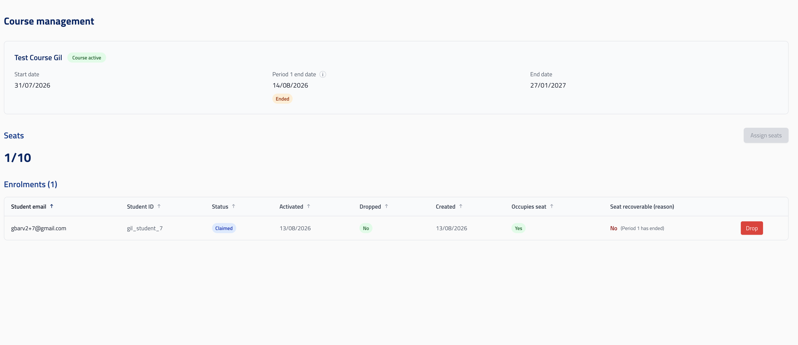
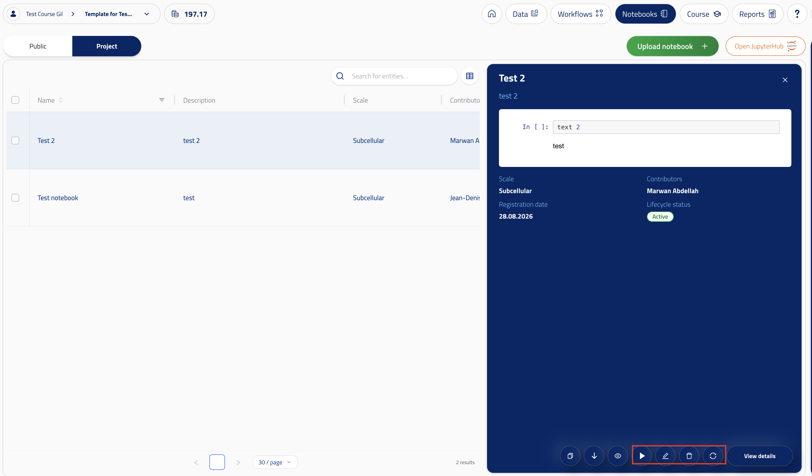

# Courses Interface

To enable the courses feature, you need to get an Education license for your course. Please contact your OBI representative for information.

Once we've received your payment we'll provision a special virtual lab for your course and a template project. It will be available at:

`https://openbraininstitute.org/app/virtual-lab/{virtual-lab-id}/{project-id}/course`

Before we provision your course you have to provide the course start date, period 1 end date and course end date.

### Course start date

You will have access to the course interface and your template project, before the course starts, but students will only be granted access on the start date.

### Period 1
Period 1 end date (at most 2 weeks after the start date)

- New student assignments are only possible before Period 1 ends.
- Vacated seats can be reassigned only if:
    - The seat has never been vacated before
    - The student had spent fewer than 50 credits
    - Period 1 has not ended

### Course end date

When the course ends, the students will lose access to their projects, but faculty (the virtual lab admin) will continue to have access to all student projects. Any unused credits in either the template or the student projects will be deprovisioned.

### Assigning Students

Through the UI you can add students to the course, you will need to provide a CSV file with 2 columns:

- Unique ID
- Email

They will get an invite on their email that will grant them access to their project on the start date, they will automatically be granted 200 credits.

### Dropping students

You can drop students at any time. You will be able to re-assign that seat to another student if it is before Period 1 ends and some conditions are met (see [Period 1](#period-1)). Otherwise the seat will be lost.

### Uploading notebooks

You can upload notebooks to your template project. Simply go to the notebooks section:

`https://openbraininstitute.org/app/virtual-lab/{virtual-lab-id}/{project-id}/notebooks/browse/analysis-notebook-template`

Then click on "Upload Notebook". Any notebook uploaded to the template project will automatically be synchronized to the enrolled student projects.

### Updating notebooks

You can update notebooks through the UI, the student projects will be automatically synchronized to match the template project's notebook.

For the changes to the notebook to be reflected in Jupyterhub, students will have to click "Run" again on the notebook, as the Jupyterhub service doesn't get updated automatically.

### Synchronizing notebooks manually

If for any reason autosync fails, you can retry with the sync notebook button.

The following image shows the location of the run, edit, delete, and synchronize buttons on each notebook.

