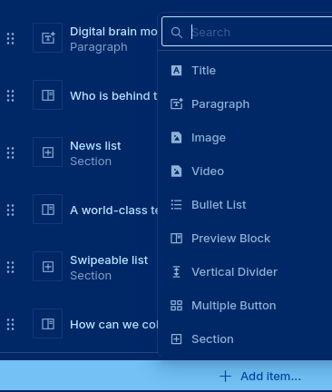

# Landing page architecture

Most of the content of the landing page is stored in Sanity:
[here is the link](https://open-brain-institute.sanity.studio/studio/structure).

We access Sanity through hooks in `content/`.
The main one is [useSanity(query, typeGuard)](../content/content.ts).
The type guard ensures that we didn't break the format of data in Sanity.
If this is the case, we get a lot of details in the console.

## Implementing widgets

A widget is a special component that the website author can add like this:



Imagine you want to implement a new widget of type `multipleButton`.

Let's first find out how it is stored in Sanity by doing a [GROQ](https://www.sanity.io/docs/groq) query:

```groq
*[_type == "pages"][]
.content[_type=="multipleButton"]
```

Here is the result:

```json
[
  null,
  null,
  {
    "buttonsList": [
      {
        "title": "The Real Digital Brain Story",
        "hasABackgroundImage": true,
        "file": {
          "_type": "file",
          "asset": {
            "_ref": "file-905c632ceb3379cc88e92de2032905bb3f718571-pdf",
            "_type": "reference"
          }
        },
        "intenalLink": {
          "_type": "internalLink",
          "targetType": "page"
        },
        "backgroundImage": {
          "_type": "image",
          "asset": {
            "_ref": "image-8fc2ef3e0d3774728ca38912f914d4cb07062fc5-1176x502-jpg",
            "_type": "reference"
          }
        },
        "_type": "simpleButton",
        "linkType": "downloadableFile",
        "_key": "321daba80a7b"
      },
      {
        "_type": "simpleButton",
        "linkType": "downloadableFile",
        "_key": "288fa12399a6",
        "title": "OBI Background",
        "hasABackgroundImage": true,
        "file": {
          "_type": "file",
          "asset": {
            "_type": "reference",
            "_ref": "file-9279bc9b9904e5da9c82d779f0ff788c9f83e845-pdf"
          }
        },
        "intenalLink": {
          "_type": "internalLink",
          "targetType": "page"
        },
        "backgroundImage": {
          "_type": "image",
          "asset": {
            "_ref": "image-43a73c0020ee82b463b4170cd2bc05b0f927db1f-1176x502-jpg",
            "_type": "reference"
          }
        }
      }
    ],
    "_type": "multipleButton",
    "_key": "947b1eb53906"
  }
]
```

Stripping all unnecessary attributes, we can deduce this type:

```ts
export interface ContentForRichTextMultipleButton {
  _type: 'multipleButton';
  buttonsList: Array<{
    title: string;
    href: string;
    backgroundURL: string;
    backgroundWidth: number;
    backgroundHeight: number;
  }>;
}
```

We need to add this type in [`content/types.ts`](../content/types.ts) as long as the type guard:

```ts
const typeContentForRichTextMultipleButton = {
  _type: ['literal', 'multipleButton'],
  buttonsList: [
    'array',
    {
      title: 'string',
      href: 'string',
      backgroundURL: 'string',
      backgroundWidth: 'number',
      backgroundHeight: 'number',
    },
  ],
} satisfies TypeDef;
```

In the same file, we need to update the type `ContentForRichText` and
the variable `typeContentForRichText`:

```ts
export type ContentForRichText = Array<
  | ContentForRichTextItems
  | ContentForRichTextTitle
  | ContentForRichTextWidget
  | ContentForRichTextParagraph
  | ContentForRichTextVerticalSpace
  | ContentForRichTextPreview
  | ContentForRichTextImage
  | ContentForRichTextVideo
  | ContentForRichTextMultipleButton
>;

const typeContentForRichText: TypeDef = [
  'array',
  [
    '|',
    typeContentForRichTextItems,
    typeContentForRichTextTitle,
    typeContentForRichTextWidget,
    typeContentForRichTextVerticalSpace,
    typeContentForRichTextParagraph,
    typeContentForRichTextPreview,
    typeContentForRichTextImage,
    typeContentForRichTextVideo,
    typeContentForRichTextMultipleButton,
  ],
];
```

Now, we need to update the GROQ query ([`content/content.groq`](../content/content.groq)) to make it match our expected type.

```grok
*[_type=="pages"][slug.current=="<SLUG>"][0]{
  content[] {
    ...,
    buttonsList[] {
      title,
      "href": file.asset->url,
      'backgroundURL': backgroundImage.asset->url,
      'backgroundWidth': backgroundImage.asset->metadata.dimensions.width,
      'backgroundHeight': backgroundImage.asset->metadata.dimensions.height,
    },
    "image": image.asset->{
      url,
      "width": metadata.dimensions.width,
      "height": metadata.dimensions.height,
    },
    "background": backgroundImage.asset->{
      url,
      "width": metadata.dimensions.width,
      "height": metadata.dimensions.height,
    },
    "button": {
      "label": buttonLabel,
      "link": internalLink->slug.current
    },
    content[] {
      ...,
      'imageURL': image.asset->url,
      'imageWidth': image.asset->metadata.dimensions.width,
      'imageHeight': image.asset->metadata.dimensions.height,
    }
  }
}.content
```

The final step is to implement a widget called `SanityContentMultipleButton`, in the folder `components/SanityContentRTF`.

```ts
import React from 'react';

import { classNames } from '@/util/utils';
import { ContentForRichTextMultipleButton } from '@/components/LandingPage/content';

import styles from './SanityContentMultipleButton.module.css';

export interface SanityContentMultipleButtonProps {
  className?: string;
  value: ContentForRichTextMultipleButton;
}

export function SanityContentMultipleButton({
  className,
  value,
}: SanityContentMultipleButtonProps) {
  return (
    <div className={classNames(className, styles.sanityContentMultipleButton)}>
      {/* Put your code here... */}
    </div>
  );
}
```

Finally, we have to register this new widget by updating [`SanityContentRTF.tsx`](.../components/SanityContentRTF/SanityContentRTF.tsx):

```ts
function renderItem(
  item:
    | ContentForRichTextTitle
    | ContentForRichTextItems
    | ContentForRichTextWidget
    | ContentForRichTextParagraph
    | ContentForRichTextVerticalSpace
    | ContentForRichTextPreview
    | ContentForRichTextImage
    | ContentForRichTextVideo
    | ContentForRichTextMultipleButton,
  index: number
) {
  const key = `${item._type}/${index}`;
  switch (item._type) {
    case 'multipleButton':
      return <SanityContentMultipleButton key={key} value={item} />
```
