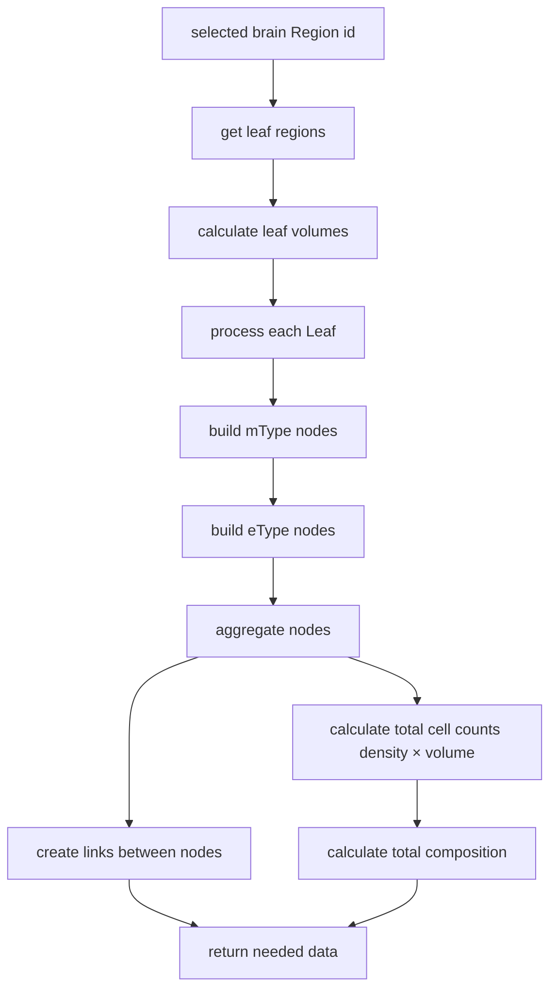

# HOW-TO: Construct Brain Cell Composition

This short document explains how cell composition has been constructed,
which builds a hierarchical representation of brain cell types and their
densities across brain regions.

## Overview

The cell composition feature processes hierarchical brain region data
along with cell type information to generate a unified view of neuron
and glial cell distributions. It handles relationships between
`brain_region`, `mTypes`, `eTypes`.

## Data Flow

