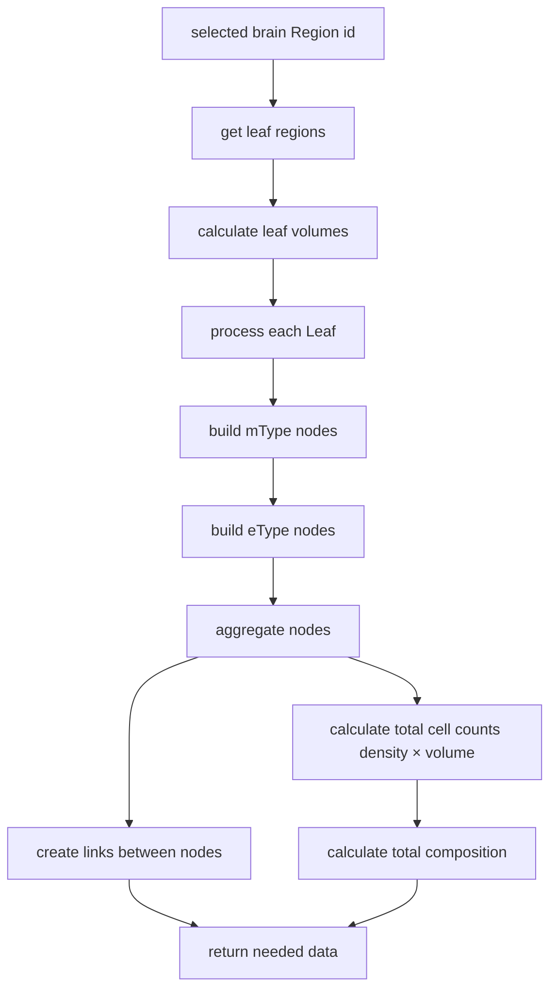
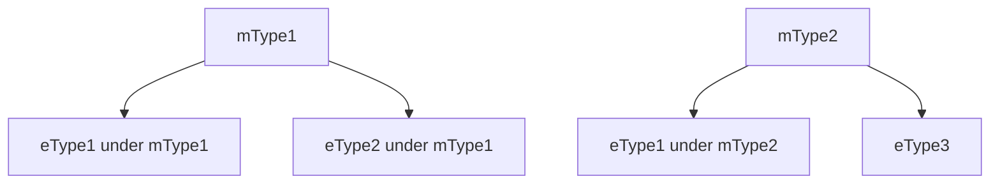

# HOW-TO: Construct Brain Cell Composition

This short document explains how cell composition has been constructed, which builds a hierarchical representation of brain cell types and their densities across brain regions.

## Overview

The cell composition feature processes hierarchical brain region data along with cell type information to generate a unified view of neuron and glial cell distributions. It handles relationships between `brain_region`, `mTypes`, `eTypes`.

## Data Flow

## How to process:

1. **Initialization**
   - start with a brain region id (selected by the user)
   - retrieve all leaf regions under that brain region (use `brainRegionHierarchyAtom`)
   - create volume maps for each leaf region (using `brainRegionAtlasAtom`)

2. **Node Construction**
   - for each leaf region:
     - process mTypes and their child eTypes
     - build tree nodes with cell counts and densities
     - calculate composition data based on volumes

3. **Node Aggregation**
   - merge nodes that represent the same mType/eType across different leaf regions
   - sum cell counts across regions
   - recalculate densities based on aggregated volumes
   - create links between parent mTypes and child eTypes

4. **Final Calculations**
   - calculate total neuron and glial cell counts
   - determine total volume (not needed for now)
   - compute the whole composition densities

## Implementation Details

### Composite IDs

The system uses composite IDs (`mTypeId__eTypeId`) to ensure that when the same eType appears under different mTypes, they are treated as distinct nodes. This preserves the hierarchical relationship.

### Volume and Density calculations:

- **cell count** = density × volume
- **aggregated density** = totalCellCount / TotalVolume
- **neuron count scale** = 1e-9

### Node merging:

When the same node (by composite ID) appears in multiple leaf regions:

1. merge the lists of associated leaf regions
2. sum the cell counts from all regions
3. recalculate densities based on the total volume of all associated regions
4. combine related nodes (for mTypes pointing to eTypes)

## Output:

The final output contains:

- **nodes**: Array of tree nodes representing mTypes and eTypes
- **links**: Connections between parent mTypes and child eTypes
- **totalVolume**: Combined volume of all leaf regions
- **totalComposition**: Overall neuron and glial cell densities and counts
