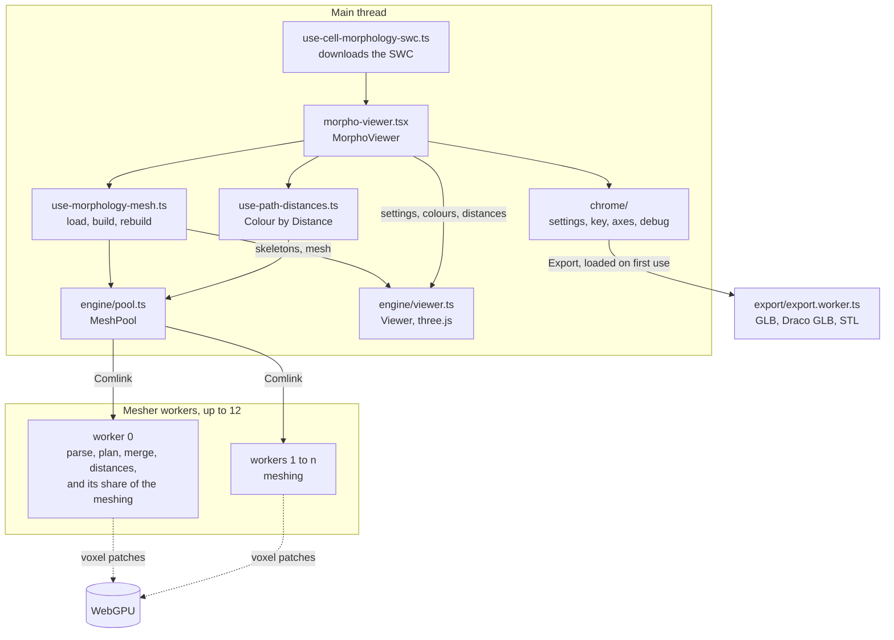
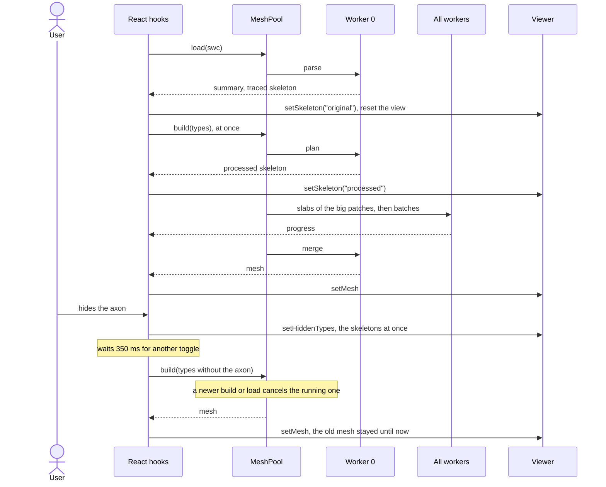
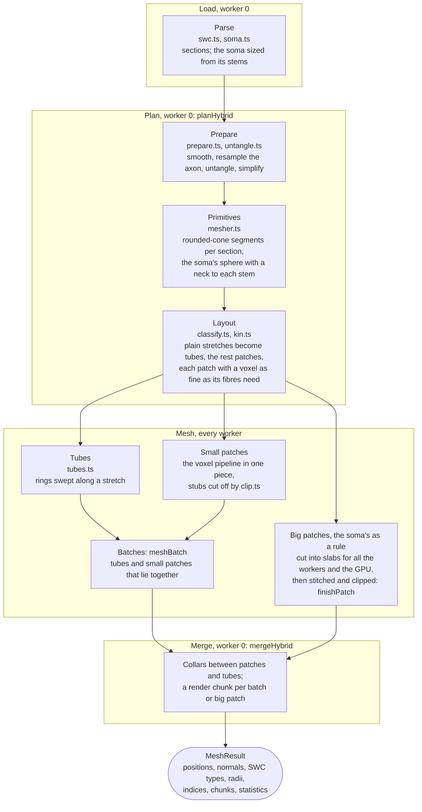
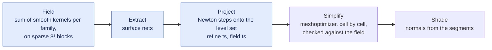
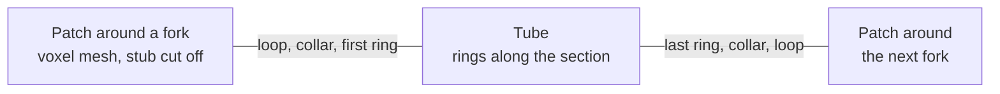
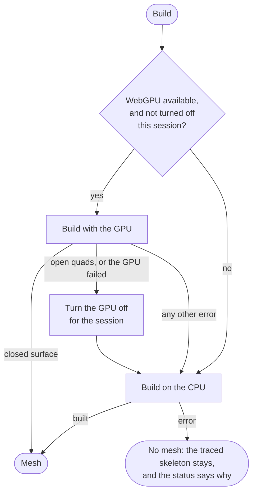

# Morphology viewer

The 3D view of a cell morphology. It builds a closed surface mesh from the SWC in the browser, in a pool of Web Workers, and draws it with three.js. This page is the overview: what runs where, the stages of a build, and where to change what. [engine/README.md](engine/README.md) is the in-depth reference for the meshing, with the reasoning behind each step and the measurements.

In short:

- The traced skeleton shows as soon as the SWC is parsed, each fibre as wide as the mesh will draw it. The mesh takes over once it is built: about half a second for a cortical cell, a few seconds for a whole-brain projection neuron.
- The Traced skeleton is the file as written, to check the mesh against: a neurite on the soma starts at the soma point the file links it to, which on a soma of several points can lie at its edge. The Processed skeleton is what the mesh is built from, necks included (`meshedSections` in [engine/mesher.ts](engine/mesher.ts)).
- Where a neurite runs alone, its surface is swept as a tube. Around branch points, the soma and places where fibres touch, a voxel field is meshed instead, and the two are joined by collars.
- The voxel work runs on the GPU (WebGPU) where the browser has it, and on the CPU otherwise.
- The build parameters have fixed defaults (`DEFAULT_BUILD` in [constants.ts](constants.ts)), which only the Debug menu changes. What the user changes is how the mesh is drawn, and which neurite types it includes.

## From the SWC to the screen

- [morpho-viewer.tsx](morpho-viewer.tsx) creates one `Viewer` and one `MeshPool` per mounted viewer, and disposes of both when it unmounts, which terminates the workers and releases the WebGL context. It keeps what the user chose in [use-viewer-settings.ts](use-viewer-settings.ts) and applies each setting to the `Viewer` as it changes.
- `MeshPool` ([engine/pool.ts](engine/pool.ts)) talks to the workers through Comlink. Worker 0 holds the parsed morphology: it parses, plans and merges. Every worker a build uses, worker 0 included, meshes the pieces of it. A worker starts the first time it is needed and is kept for the next builds. A build uses at least 4 workers and one more per 2 mm of the cable it meshes, up to the pool's size (`workersFor`), so a small cell does not start a dozen. A worker that dies fails its calls instead of leaving them hanging.
- Each worker runs [engine/mesher-api.ts](engine/mesher-api.ts), which takes one call at a time.
- `Viewer` ([engine/viewer.ts](engine/viewer.ts)) knows nothing of React. The hooks call it (`setMesh`, `setSkeleton`, `setColors`, `setLook` and so on), and it only renders a frame when the camera moves or something changed.

## Load, build and rebuild

[use-morphology-mesh.ts](use-morphology-mesh.ts) runs this. The first build starts at once, and a rebuild waits 350 ms (`REBUILD_DELAY`), so that several quick toggles cost one build. Toggles that end where they started cost none. While a mesh is being rebuilt, Export is held, since the mesh on show still has the types just hidden. If a build fails, the mesh is dropped, the traced skeleton stands in, and the status pill says why.

## The build

| Stage | Files | What it does |
| --- | --- | --- |
| Parse | [swc.ts](engine/swc.ts), [soma.ts](engine/soma.ts) | Reads the SWC into sections: unbranched chains of one type. Sizes the soma from where its stems start rather than from the traced soma, and plans a neck to each stem. The soma centre becomes the origin (the bounding-box centre without a soma). |
| Prepare | [prepare.ts](engine/prepare.ts), [untangle.ts](engine/untangle.ts) | Smooths radii and paths, resamples the axon at steps of at most 5 µm, moves apart fibres that the tracing ran through each other, and simplifies each section. |
| Primitives | [mesher.ts](engine/mesher.ts) | Turns each section into rounded-cone segments, and the soma into a sphere with a neck to each stem. Types left out (the eyes in the key) are dropped here; the soma always stays. |
| Layout | [classify.ts](engine/classify.ts), [kin.ts](engine/kin.ts) | Decides what blends with what ([kin.ts](engine/kin.ts): the sections around a fork, the soma and its stems, fibres that touch). A stretch that nothing else reaches is a plain tube; the rest is grouped into patches, each with its own voxel size. |
| Tubes | [tubes.ts](engine/tubes.ts) | Sweeps rings along a plain stretch, as many around as the tolerance needs, with round caps at free ends. |
| Patches | [mesher.ts](engine/mesher.ts), [clip.ts](engine/clip.ts), [gpu-slab.ts](engine/gpu-slab.ts) | Meshes the patch's voxel field (next diagram), then cuts the capped stubs where tubes take over. |
| Merge | [hybrid.ts](engine/hybrid.ts) | Joins the pieces, fills the collars, and records a render chunk per batch or big patch (and one for the collars), so that three.js can cull what is out of view. |

### One voxel patch

The steps in blue, and the simplification's check, run on the GPU where there is one ([gpu-slab.ts](engine/gpu-slab.ts)); meshoptimizer itself always runs on a worker. A patch too large for one worker's share is cut into slabs along one axis. Every slab uses the same global grid, so a sample on either side of a cut has the same value to the bit, and the slabs stitch without a seam.

### Where tubes meet patches

A section between two forks, from one patch to the next:

A patch is meshed from a copy of the skeleton around it whose sections run on a little past it, so its surface is closed, with a capped stub on every section that leaves it. [clip.ts](engine/clip.ts) cuts each stub at a plane across its section, which leaves a loop of vertices on the exact surface. The tube starts a collar's length farther on, with a ring of its own, and `mergeHybrid` fills the collar between loop and ring. Tubes and patches share no vertices, so they can be meshed in any order on any worker.

## Which mesher, which backend

- The first viewer of a session asks the workers whether WebGPU is there and can build the shaders. The answer holds for the session (`gpuStatus` in [use-morphology-mesh.ts](use-morphology-mesh.ts)).
- On either backend, if the tubes fail (a clip that finds no loop, a ray that finds no surface), the pool builds voxels throughout instead ([pool.ts](engine/pool.ts)), and the statistics say why.
- The statistics in the Debug menu say where the mesh was built, and why there.

## Colours and path distances

- The mesh carries an 8-bit colour per vertex. `Viewer.setColors` writes into it from the SWC type of each vertex ([colors.ts](engine/colors.ts)), and does the same for each skeleton segment. No rebuild is needed.
- Looks declare what the neurite colours do in them (`Look.colors` in [looks.ts](engine/looks.ts)): colour the cell, tint it while Type tint is on, or nothing. The chrome disables the colour controls where they have no effect, and says why.
- Colour by Distance asks worker 0 for the path distance to the soma ([distances.ts](engine/distances.ts)), once per layer: the mesh, and each skeleton. Distances run along the tree, with the soma at 0. A mesh vertex takes the distance at the closest point of the nearest segment of its own type, so that where an axon crosses a dendrite each keeps its own.
- [use-path-distances.ts](use-path-distances.ts) keys the answers by the layer object they were measured for, so that a late answer cannot colour a newer mesh.

## Debug menu and export

[chrome/debug-menu.tsx](chrome/debug-menu.tsx) holds, in this order:

- the statistics of the file and the build;
- the controls ([chrome/debug-controls.tsx](chrome/debug-controls.tsx)): the POC's build parameters, a GPU switch and the bumps' shape;
- the downloads.

It shows only where the `morphology-debug` flag is on (`morphologyDebugFlag` in `src/features/feature-flags/flags.ts`). The Feature Flags tab lists it in local, preview and staging, off by default.

The controls live in the viewer's settings (`build` and `bump`) for as long as the page is open. A change to the build rebuilds the mesh after the same pause as the eyes, and draws the processed skeleton again. The GPU switch is held off, with the reason, once the session has no GPU. `buildParams` in [constants.ts](constants.ts) turns the controls' units (µm, or × voxel) into the mesher's.

The menu loads [export/](export/index.ts) on the first download. That module starts [export/export.worker.ts](export/export.worker.ts), which writes the file and is terminated after:

- GLB and Draco GLB go through glTF-Transform ([export/glb.ts](export/glb.ts)). Draco's encoder is a WASM file fetched on demand, and the position bits follow the voxel the mesh was built with.
- STL ([export/stl.ts](export/stl.ts)) is triangles only.

The file holds the mesh on show, in µm around the soma, with the current neurite colours. The look and its bumps are not part of it.

## Where to change what

| To change | Look in |
| --- | --- |
| Build parameters (voxel size, smoothing, blends, tolerances) | `DEFAULT_BUILD` in [constants.ts](constants.ts), described in [engine/README.md](engine/README.md#build-parameters); their controls in [chrome/debug-controls.tsx](chrome/debug-controls.tsx) |
| Default palettes, bumps and min. width | [constants.ts](constants.ts) |
| Number of workers | `defaultPoolSize`, and per build `workersFor`, in [engine/pool.ts](engine/pool.ts) |
| Rebuild delay, GPU and CPU policy | [use-morphology-mesh.ts](use-morphology-mesh.ts) |
| Looks | `createLooks` in [engine/looks.ts](engine/looks.ts) |
| Settings, key, Debug menu (statistics, controls and export) | [chrome/](chrome/morpho-viewer-chrome.tsx) |
| Axes gizmo | [chrome/axes-gizmo.tsx](chrome/axes-gizmo.tsx); the turn to an axis in [engine/gizmo.ts](engine/gizmo.ts) and [engine/rotation.ts](engine/rotation.ts) |
| Help card texts | [help/help-text.ts](help/help-text.ts) |
| Menu shell shared with the circuit viewer | `src/features/scan-config/components/color-by/chrome-menu.tsx` |

## Tests

- `src/__tests__/cell-morphology/mesher/` covers the engine in Node, without WebGPU. It includes closed-surface checks on the sample cell in `fixtures/`, the pool with in-process workers, the path distances and the exports.
- `src/__tests__/cell-morphology/morpho-viewer.test.tsx` covers the React side, with the viewer and the pool faked.
