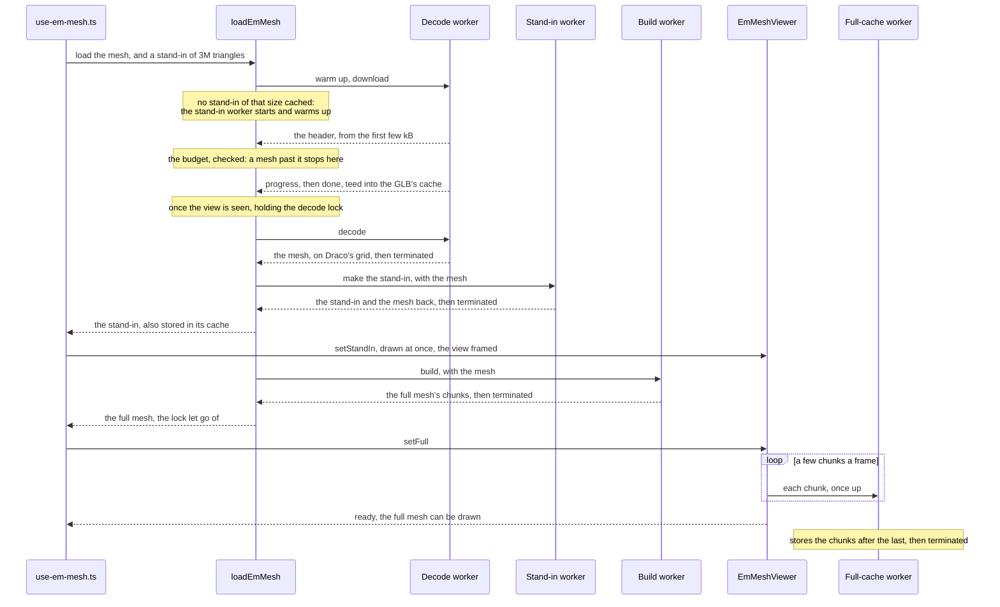
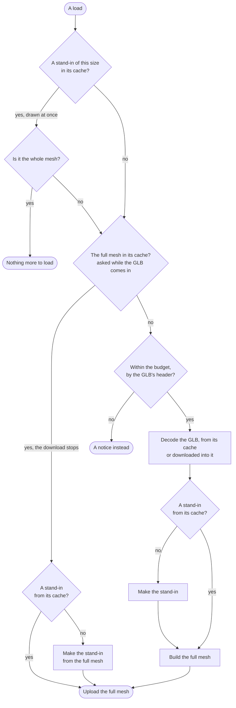
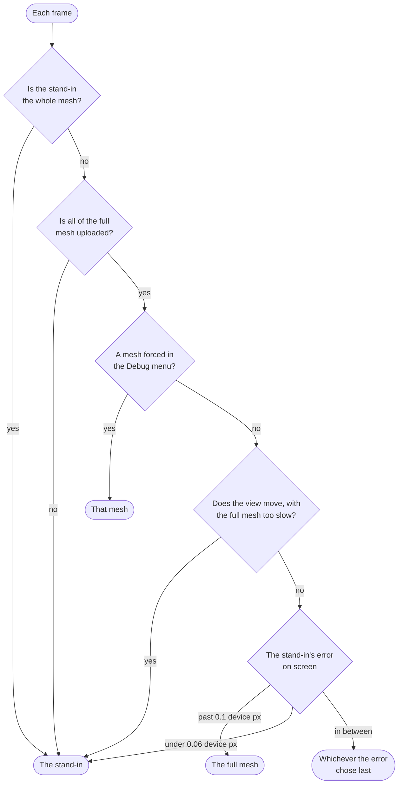

# EM cell mesh viewer

The 3D view of an EM cell mesh, on its Overview. It loads the mesh's GLB whole in the browser, decodes and packs it in Web Workers, and draws it with three.js, on the scene and chrome it shares with the morphology viewer. This page is the overview: what runs where, the steps of a load, which mesh a frame draws, and where to change what. [engine/README.md](engine/README.md) is the in-depth reference, with the reasoning behind each step and the measurements.

In short:

- The viewer holds two meshes: a coarse stand-in of at most 3M triangles, drawn as soon as it is made, and the full mesh, which takes over once all of it is on the GPU. On the largest staging mesh (27.5M triangles, a 19 MB GLB), the stand-in shows about 3 s after the GLB is in, and the full mesh about 1.5 s later, on an M4 Pro.
- Each frame draws one of the two: the full mesh, unless the stand-in's error on screen is far under a device pixel (zoomed far out), or the view moves on a GPU too slow for the full mesh. Moving frames that are still too slow leave out the ambient occlusion, then draw fewer pixels.
- The steps that take the most memory run in workers, one at a time, each terminated once done, which is the only way to give its WASM memory back; and one tab at a time. A mesh too large for the browser or the device is refused from its header, before anything is decoded.
- The GLB, the stand-in and the full mesh as packed are kept in Cache Storage: a mesh seen before shows with no download, decode or build.
- The stand-in's size and how moving frames are cut down have defaults that only the Debug menu changes. What the user changes is how the mesh is drawn.

## From the GLB to the screen

```mermaid
flowchart TB
  subgraph main["Main thread"]
    viewer["em-mesh-viewer.tsx<br/>EmCellMeshViewer"] --> hook["use-em-mesh.ts<br/>loads, reloads, marks"]
    viewer --> chrome["chrome/<br/>settings, status, debug, axes"]
    hook --> load["engine/load.ts<br/>loadEmMesh"]
    hook -- "stand-in, full mesh" --> three["engine/em-mesh-viewer.ts<br/>EmMeshViewer, three.js"]
    viewer -- "settings" --> three
  end
  subgraph workers["Workers, each terminated once done"]
    decode["decode.worker.ts<br/>download, Draco"]
    standIn["stand-in.worker.ts<br/>the stand-in"]
    build["build.worker.ts<br/>the full mesh's chunks"]
    keep["full-cache.worker.ts<br/>the full mesh's cache"]
  end
  load -- "Comlink" --> decode & standIn & build & keep
  three -. "each chunk, once up" .-> keep
  decode -. "read, write" .-> glbCache[("em-cell-mesh-glb")]
  load -. "read, write" .-> standInCache[("em-cell-mesh-stand-in")]
  keep -. "read, write" .-> fullCache[("em-cell-mesh-full")]
```

- The Overview shows the viewer's card, `EmCellMeshViewerCard` ([../detail-view.tsx](../detail-view.tsx)), for a mesh with a GLB labelled `cell_surface_mesh` (`meshAsset` in [mesh-asset.ts](mesh-asset.ts)); a mesh without one has no card. There is no Mesh viewer tab: old `/mesh-viewer` links go to the Overview (`next.config.ts`).
- [em-mesh-viewer.tsx](em-mesh-viewer.tsx) creates one `EmMeshViewer` per mounted viewer, and disposes of it when it unmounts, which releases the WebGL context. It keeps what the user chose in [use-em-viewer-settings.ts](use-em-viewer-settings.ts) and applies each setting to the viewer as it changes.
- [use-em-mesh.ts](use-em-mesh.ts) runs a load for the mesh and the stand-in's size, and aborts it when either changes or the card goes. It hands the meshes to the viewer, and keeps what the status and the Debug menu show.
- `loadEmMesh` ([engine/load.ts](engine/load.ts)) is the pipeline, without React. It starts each worker, hands the arrays from one to the next through the page, transferred rather than copied, and terminates each once done. Each worker's API is in [engine/worker-apis.ts](engine/worker-apis.ts). A worker that dies, out of memory say, fails the step it was on instead of leaving it hanging.
- `EmMeshViewer` ([engine/em-mesh-viewer.ts](engine/em-mesh-viewer.ts)) knows nothing of React. It holds the two meshes, uploads the full one a few chunks a frame, and chooses which one each frame draws. It is a `SceneViewer` ([scene-viewer.ts](../../../viewer-3d/engine/scene-viewer.ts)), the scene, cameras, looks and passes it shares with the morphology viewer, set to draw every frame through the composer and to take the occlusion from the main pass's depth.

## A load

A first visit:

Where each mesh comes from, on any visit:

- A mesh with no more triangles than the stand-in may have is its own stand-in, whole: nothing more is built or uploaded.
- The full mesh's cache answers while the GLB downloads, so a hit stops the download part way. A mesh refused at its header, or a download that fails, offline say, still loads from that cache.
- The decode, the stand-in and the build hold a Web Lock (`em-mesh-decode`), so that two tabs don't reach their peaks together. A view not seen yet, in a tab opened in the background or scrolled past, downloads and reads its caches, but makes nothing until it is seen.

[use-em-mesh.ts](use-em-mesh.ts) runs a load per mesh and stand-in size:

- Another mesh clears the view and aborts the load under way, which terminates its workers. So does the card going.
- Another stand-in size, from the Debug menu, loads the mesh again, keeping what the viewer has until the new load's meshes replace it. Each size has its own cache entry.
- A load past its download marks the mesh in `localStorage` until its full mesh is drawn ([load-mark.ts](load-mark.ts)). A tab the browser stops mid-load, out of memory say, leaves the mark behind. The next visit then shows the cached stand-in, if there is one, and offers to try again rather than stopping the page again. A mark is not heeded while any tab holds the decode lock, as it may be that tab's load.
- A context lost with the full mesh loads it again, keeping the stand-in, once the page is on show. After a second loss for the same mesh, it does so only when asked.

## Which mesh a frame draws

- `MeshChooser` ([engine/mesh-choice.ts](engine/mesh-choice.ts)) chooses, in that order, before every frame.
- The stand-in's error is how far its simplification may have moved the surface, in µm. On screen it is counted in device pixels, the canvas's own: in the orthographic view from the scale bar's µm per CSS pixel, and in perspective at the point of the mesh's bounds nearest the camera, where it looks largest.
- The thresholds are far under a pixel because the stand-in loses what is thinner than its cubes, spines and the thinnest axons, rather than moving it. At overview zoom the full mesh is drawn, on any screen; the stand-in only zoomed far out.
- Too slow means a full frame costs the GPU more than 28 ms (the median of the last three), or two moving frames of the full mesh in a row did, as zooming out makes them dearer; the second holds until the view stops. The still frame after a move draws the full mesh again.

## Frames while the view moves

- Frames are timed on the GPU ([engine/gpu-timer.ts](engine/gpu-timer.ts)): with timer queries in Chrome and Edge on desktop, with a fence elsewhere. A moving frame is timed from the third after a pause, and only where the frame before drew the same mesh, cut down the same way: a GPU waking up draws its first frames slowly.
- One over the budget, 18 ms (55 frames a second), is cut down a step (`MotionQuality` in [engine/motion-quality.ts](engine/motion-quality.ts)): first the ambient occlusion is left out, then half the pixels a step, down to a quarter of the resolution. Frames cut to fewer pixels, or set to draw without antialiasing, go through a second composer, made the first time one is, and are scaled up onto the canvas.
- They step back up a step at a time where they would keep within 80 % of the budget, and all the way up as soon as the view stops, where a full frame does.
- The still frame, once the view stops, is drawn in full: with the occlusion where it is on, at full resolution, antialiased.
- The Debug menu sets each of these, to compare on a given machine.

## Status and notices

The pill at the top centre ([chrome/load-status.tsx](chrome/load-status.tsx)) says, from the first that applies:

| When | What shows |
| --- | --- |
| The context was lost | "The graphics were reset, restoring…"; after 5 s without it back, an alert to reload the page |
| The mesh stopped the page last time | An alert, over the cached stand-in if there is one, with "Try again" and "Download the GLB" |
| Too many triangles for Draco, about 28M | "Too large to view in the browser", with "Download the GLB" |
| Over the device's memory budget | "This mesh may be too large for this device", with "Load anyway" |
| The load failed before the stand-in | "The mesh could not be loaded", and why |
| The load failed after it | "Full detail could not be loaded", the stand-in staying on show |
| A second lost context for the mesh | "Full detail was let go of after the graphics reset", with "Load it" |
| The full mesh can be drawn | Nothing |
| Loading, with the stand-in on show | "Loading full detail…", with the download's progress while there is one |
| Loading, no stand-in yet | "Downloading 4.1 / 8.0 MB", then "Decoding…" |

## Settings and the Debug menu

[chrome/settings-menu.tsx](chrome/settings-menu.tsx) holds the look, the ambient occlusion, spin, perspective, the scale bar and the background, each with a help card. The viewer opens in the EM segmentation look, which turns the occlusion on. It offers 13 of the 14 shared looks: Fluorescence colours by neurite type, which an EM mesh doesn't have. The looks that draw in the neurite colours draw the mesh in a plain colour of their own, and none has bumps or a width floor (`createLooks` in [looks.ts](../../../viewer-3d/engine/looks.ts)).

The chrome is laid out as the morphology viewer's ([chrome/em-viewer-chrome.tsx](chrome/em-viewer-chrome.tsx)): fullscreen, settings and debug at the top left, with re-centre under them; the status at the top centre; the scale bar, in the orthographic view, at the bottom left; the axes gizmo at the bottom right. A double-click toggles fullscreen. Outside it the wheel zooms with Ctrl, and a plain wheel scrolls the page.

[chrome/debug-menu.tsx](chrome/debug-menu.tsx) holds, in this order:

- the load: where the GLB and each mesh came from, their triangles, vertices and chunks, the grid, and how long each step took;
- the memory: Draco's and meshoptimizer's WASM at their peaks, the budget, and what the GPU holds, frame buffers included;
- the view: the mesh on show and why, the stand-in's error on screen, what full and moving frames cost and how they are drawn, and the upload;
- switches to compare: where the occlusion reads its depth, a mesh drawn whatever the zoom, the stand-in's size (1.5M, 3M, 5M or 8M triangles, which loads the mesh again), and the chunks' bounds;
- Moving frames: the mesh, the occlusion, the resolution and the antialiasing, each chosen by the cost or set; the two budgets ("Cut down past" and "Stand-in past"); and Frame times, which shows what moving frames cost over the view, as the menu closes once the view is dragged ([chrome/frame-times.tsx](chrome/frame-times.tsx));
- the GLB as stored, from the cache where it is there ([save-glb.ts](save-glb.ts)).

It shows only where the `em-mesh-debug` flag is on (`emMeshDebugFlag` in `src/features/feature-flags/flags.ts`). The Feature Flags tab lists it in local, preview and staging, off by default. What the menus set lives in the viewer's settings for as long as the Overview is open.

## Where to change what

| To change | Look in |
| --- | --- |
| The stand-in's size, and the sizes the Debug menu offers | `STAND_IN_TRIANGLES` in [engine/stand-in.ts](engine/stand-in.ts); `STAND_IN_CHOICES` in [chrome/debug-menu.tsx](chrome/debug-menu.tsx) |
| Where the full mesh comes in and goes | `FULL_ABOVE_PX` and `STAND_IN_BELOW_PX` in [engine/mesh-choice.ts](engine/mesh-choice.ts) |
| When moving frames are cut down, or draw the stand-in | `DEFAULT_MOTION` in [engine/motion-quality.ts](engine/motion-quality.ts) |
| The memory budget | [engine/budget.ts](engine/budget.ts) |
| The caches' names, lifetimes and sizes | `GLB_CACHE` and `STAND_IN_CACHE` in [engine/asset-cache.ts](engine/asset-cache.ts); `FULL_CACHE` in [engine/full-cache.ts](engine/full-cache.ts) |
| What a cached stand-in or full mesh holds | Change `STAND_IN_VERSION` in [engine/stand-in-cache.ts](engine/stand-in-cache.ts) or `FULL_VERSION` in [engine/full-cache.ts](engine/full-cache.ts) with it, or old entries are read back as new |
| Chunk sizes, and how a vertex is packed | [engine/chunks.ts](engine/chunks.ts) |
| How long uploads may take of a frame | `UPLOAD_BUDGET_MS` in [engine/em-mesh-viewer.ts](engine/em-mesh-viewer.ts) |
| Looks | `createLooks` in [viewer-3d/engine/looks.ts](../../../viewer-3d/engine/looks.ts) |
| Cameras, controls, the composer and its passes | `SceneViewer` in [viewer-3d/engine/scene-viewer.ts](../../../viewer-3d/engine/scene-viewer.ts) |
| Settings, status, Debug menu | [chrome/](chrome/em-viewer-chrome.tsx) |
| Help card texts | [help/help-text.ts](help/help-text.ts) |
| Which meshes get a viewer | `meshAsset` in [mesh-asset.ts](mesh-asset.ts) |

## Tests

- `src/__tests__/em-cell-mesh/` covers the pipeline in Node and the viewer in jsdom:
  - the GLB and Draco, on two small real files in `fixtures/` and on GLBs encoded from a torus (`mesh-fixtures.ts`);
  - the chunks, the clustering, the stand-in, and the caches, on an in-memory Cache Storage (`fake-caches.ts`);
  - the load, with each worker's API in this thread behind a `MessageChannel`, so that arrays are really transferred;
  - the choice of mesh, the moving frames and the GPU timer;
  - `EmMeshViewer` with the renderer faked, and the React side with the viewer and the load faked.
- `src/__tests__/viewer-3d/` covers the shared scene: the composer, the occlusion from the main pass's depth, the warm-up, moving frames cut down, and the looks for a surface without colours, types or radii.
